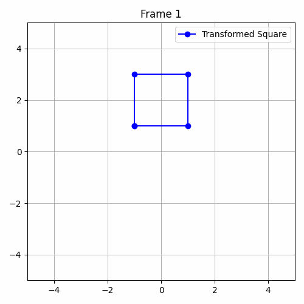
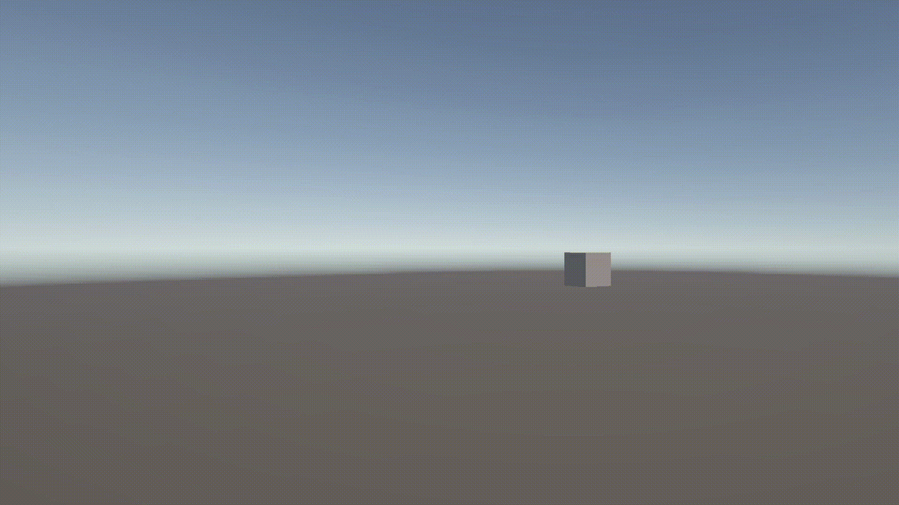
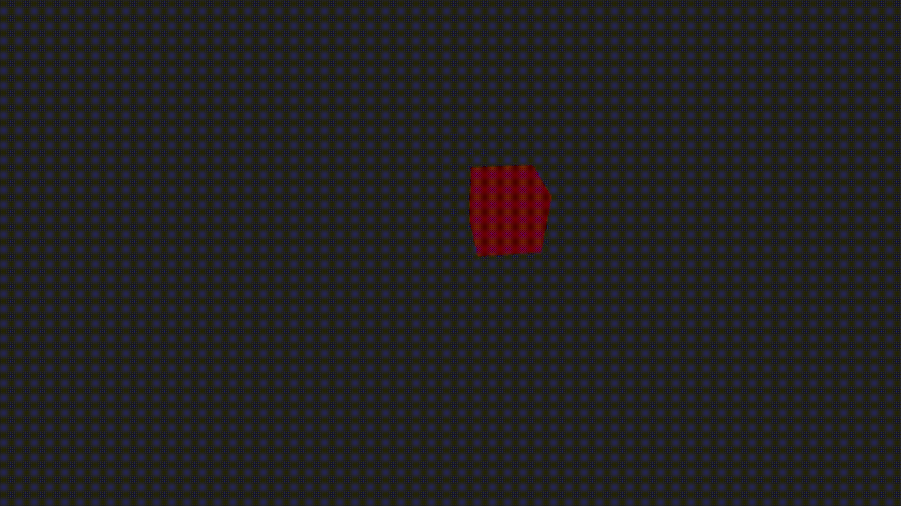
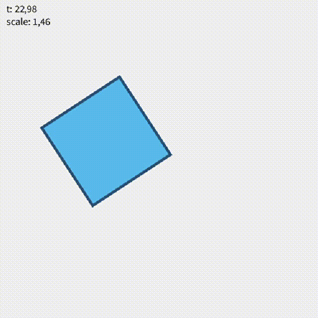

# ## Python

Se realizó una animación de un cuadrado en 2D utilizando `matplotlib` y `numpy`.  
A cada frame se le aplican transformaciones geométricas: **traslación** (movimiento en el plano), **rotación** (giro sobre el centro) y **escala** (cambio de tamaño), todas ellas mediante matrices de transformación.  
Las transformaciones varían de manera continua a lo largo del tiempo, generando una secuencia animada que se exporta como un GIF.  
El código es fácilmente modificable para usar otras figuras y parámetros.  
**GIF animado generado:**  

---

## Unity

Se creó una escena en Unity 3D con un cubo al que se le aplican transformaciones mediante un script en C#.  
El cubo se **traslada** por el eje X cada dos segundos de forma alterna, **rota** constantemente sobre el eje Y y su **escala** varía de manera oscilante usando la función seno del tiempo.  
Estas transformaciones se realizan usando las funciones `transform.Translate()`, `transform.Rotate()` y modificando `transform.localScale` en el script adjunto.  
El resultado se documenta mediante capturas y/o GIF animado de la escena en ejecución.  
**Captura/GIF animado generado:**  

## Three.js con React Three Fiber

Se desarrolló una escena 3D en React utilizando React Three Fiber y Three.js.  
Se agregó un cubo animado que experimenta **traslación** (movimiento circular en el plano), **rotación** sobre su eje Y y **escala** oscilante en función del tiempo, todo gestionado con el hook `useFrame`.  
La escena incluye `OrbitControls` para poder navegar interactivamente.  
El resultado se documenta mediante un GIF animado.  
**GIF animado generado:**  

## Processing (2D)

Se realizó un sketch en Processing que dibuja un cuadrado animado.  
El cuadrado sufre **traslación** (movimiento ondulado en el eje X), **rotación** sobre su centro y **escala** oscilante en función del tiempo mediante el uso de las funciones `translate()`, `rotate()`, `scale()`, y las variables `millis()` y `sin()`.  
Las transformaciones se aíslan con `pushMatrix()` y `popMatrix()` para mantener el código ordenado.  
El resultado se documenta mediante capturas y un GIF animado.  
**GIF animado generado:**  
