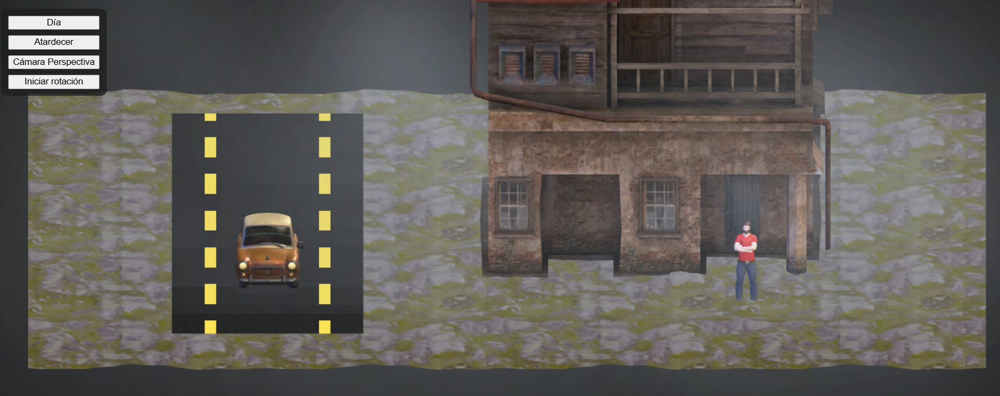
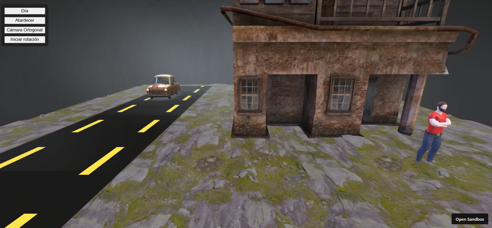
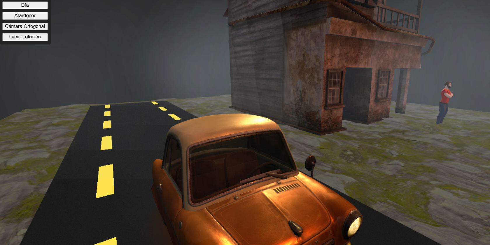
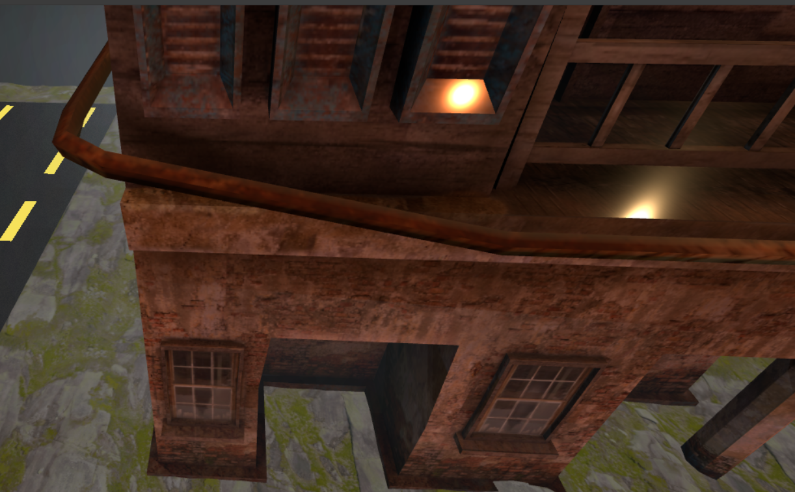
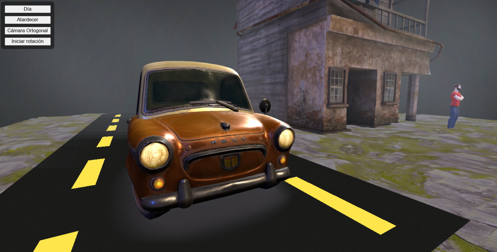
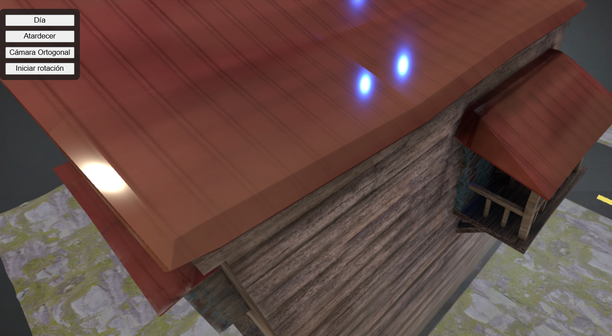
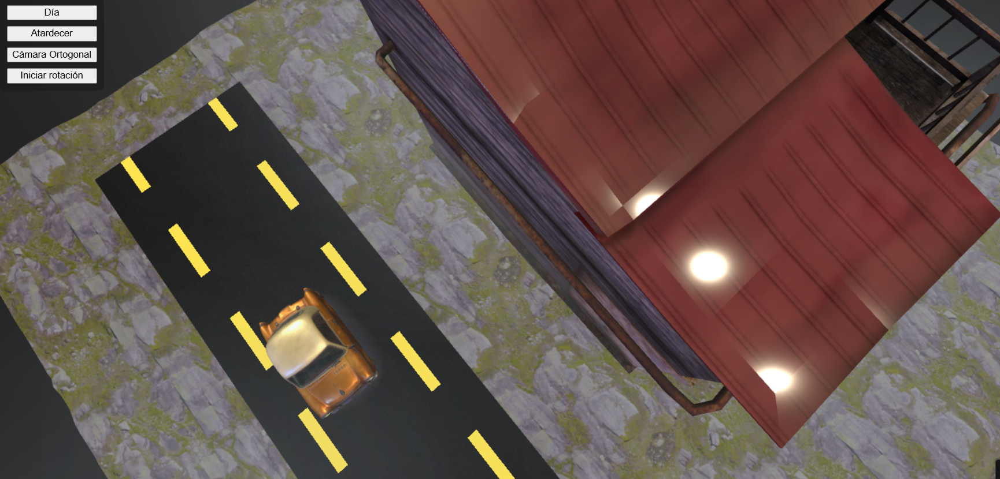
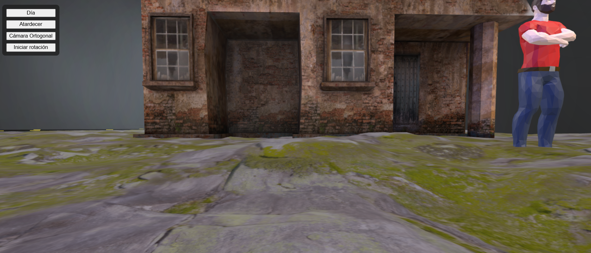

# Taller: Materiales por Iluminación y Modelos de Color — Three.js

## Concepto y Justificación

Este mundo virtual simula una escena exterior, dando la impresión de escena de videojuego de terror, con un ambiente de sombrío y abandonado,  donde la interacción de **materiales PBR**, **iluminación dinámica**, **shaders procedurales** y **modelos GLB** permite explorar cómo la percepción de los materiales cambia según la luz y el modelo de color. El usuario puede alternar entre diferentes esquemas de iluminación, tipos de cámara y activar un recorrido animado para la cámara, todo controlado por una interfaz de botones.

## Modelos GLB Usados

- **Orgánico**: `/glb_models/organic.glb`  
  Ubicación: (5, 0, 5), escala: 0.01
- **Arquitectónico**: `/glb_models/architectural.glb`  
  Ubicación: (3, 0, 0), escala: 1
- **Utilitario**: `/glb_models/utilitarian.glb`  
  Ubicación inicial: (-5, 0.5, 0), escala: 1  
  Animación: Se desplaza adelante y atrás por el eje Z, simulando tránsito por la carretera.

### Fuentes
- **Utilitario**: https://sketchfab.com/3d-models/pony-cartoon-885d9f60b3a9429bb4077cfac5653cf9
- **Orgánico**: https://sketchfab.com/3d-models/low-poly-person-bfe451f06bba4a6baa4bae9f4b0b112e
- **Arquitectónico**: https://sketchfab.com/3d-models/hause-wooden-red-42954cd771fd4c309906cbc9422c206f

## Iluminación

- **Key Light**: Luz principal desde arriba, color cálido o naranja según preset.
- **Fill Light**: Luz secundaria desde el lado opuesto, color frío (azul) o azul oscuro.
- **Rim Light**: Luz trasera, color blanco o dorado, animada lateralmente para resaltar contornos.
- **Ambient Light**: Luz ambiental blanca para suavizar sombras.

**Presets disponibles:**  
- **Día:** Colores cálidos y fríos, intensidades altas.
- **Atardecer:** Naranja y azul oscuro, menor intensidad y mayor contraste.

**Alternancia:**  
Botones en la interfaz permiten cambiar entre presets de iluminación.

*Justificación:*  
La combinación de luces cálidas y frías permite apreciar el comportamiento de los materiales bajo diferentes condiciones y resalta la geometría de los modelos. La rim light animada enfatiza los contornos y siluetas.

## Materiales y Texturas

**Piso:**  
- Material PBR con mapas:
  - **Albedo/Diffuse:** `/textures/aerial_rocks_02_diff_4k.jpg`
  - **Roughness:** `/textures/aerial_rocks_02_rough_4k.jpg`
  - **Displacement:** `/textures/aerial_rocks_02_disp_4k.png`
  
- Parámetros:
  - `roughness: 1.0`
  - `metalness: 0.1`
  - `displacementScale: 0.3`
  - Repetición de texturas: (4, 4)

*Justificación:*  
El material PBR responde a los cambios de luz y muestra relieve realista gracias al displacement y normal map. Permite observar cómo la percepción del material varía según el preset de iluminación.

## Shaders Procedurales

- **Niebla ambiental:**  
  - Partículas generadas con un shader personalizado.
  - Parámetros: 30 partículas, tamaño aleatorio (18–32), color base azul pastel (RGB: 0.7, 0.75, 0.8), efecto flicker animado por tiempo.
- **Carretera:**  
  - Shader procedural en el plano de la carretera.
  - Parámetros: ancho 0.6, líneas amarillas (RGB: 1.0, 0.9, 0.3), asfalto con ruido, bandas animadas en eje Y.

*Justificación:*  
Los shaders procedurales permiten variar la apariencia sin depender de texturas externas y dan dinamismo a la escena, enfatizando la interacción con la luz.

---

## Cámaras

- **Perspectiva:**  
  - Profundidad realista, útil para apreciar la escala.
- **Ortográfica:**  
  - Elimina perspectiva, útil para analizar proporciones y composición.
- **Alternancia:**  
  - Botón en la interfaz permite cambiar entre ambas cámaras.

*Intención:*  
Permitir al usuario explorar la escena desde diferentes perspectivas y comprender cómo la composición y los materiales se ven afectados por el tipo de cámara.

---

## Animaciones

- **Cámara (opcional):**  
  - Botón permite activar/desactivar recorrido circular de la cámara alrededor de la escena.
- **Rim Light:**  
  - Animada en el eje X para crear efectos de contraluz dinámicos.
- **Modelo Utilitario:**  
  - Movimiento adelante-atrás sobre el eje Z, simulando tránsito por la carretera.

*Justificación:*  
Las animaciones muestran activamente el cambio de materiales bajo diferentes ángulos de luz y cámara, y evidencian la interacción entre elementos.

## Modelo de Color

- **Paleta principal:**  
  - Carretera: amarillo pastel (RGB: 1.0, 0.9, 0.3), asfalto gris oscuro.
  - Niebla: azul pastel (RGB: 0.7, 0.75, 0.8).
  - Luces: cálidas (día), anaranjadas (atardecer), frías (fill).
  - Materiales: tonos piedra y roca.

*Justificación de contraste perceptual:*  
Los colores se eligieron para maximizar el contraste entre elementos utilitarios, orgánicos y arquitectónicos, siguiendo criterios de separación perceptual 

## Interfaz de Usuario

- Botones en la esquina superior izquierda permiten:
  - Cambiar entre **día** y **atardecer**
  - Alternar cámara **perspectiva/ortográfica**
  - Iniciar/detener animación de cámara

## Capturas y GIF

### Vista con cámara ortogonal

### Vista con cámara de perspectiva

### Iluminación de atardecer sobre el auto

### Iluminación de atardecer sobre la casa

### Iluminación de día sobre el auto

### Iluminación en la parte trasera de la casa

### Iluminación de día sobre la casa

### Material rocoso del piso

### GIF animado de la escena

## Animación de la escena

### Recorrido animado mostrando cambios de luz, cámaras y materiales

