# Taller Integral de Computación Visual 

Autores:

- Maria Paula Roman Arevalo
- Guillermo Moya Romero
- Santiago García Rodríguez
- Samuel Reyes Benavides

---

## Concepto del proyecto o experimento visual

Experiencia visual interactiva integral que explora el pipeline gráfico completo integrando múltiples tecnologías y paradigmas de computación visual. Este taller abarca desde el rendering en tiempo real con materiales físicamente basados (PBR) hasta la interacción multimodal mediante voz, gestos y señales biológicas sintéticas. El objetivo es articular el pipeline gráfico con entradas naturales para crear experiencias interactivas claras, reproducibles y estéticamente fundamentadas, abordando los 11 módulos propuestos desde modelado procedural hasta interfaces multimodales.

---

## Herramientas y entorno usado

- **Three.js v0.160.0** - Rendering 3D en tiempo real (Puntos 1, 3, 4)
- **Python 3.x** - Modelado procedural, análisis de señales, interacción multimodal (Puntos 2, 5, 6, 7, 8, 9, 10, 11)
- **JavaScript ES6+ / GLSL 3.0 ES** - Shaders personalizados WebGL 2.0
- **OpenCV (cv2)** - Procesamiento de imagen y video
- **MediaPipe** - Detección de landmarks de manos en tiempo real
- **SpeechRecognition / PyAudio** - Reconocimiento de voz
- **pyttsx3** - Text-to-Speech para feedback
- **python-osc** - Comunicación OSC con Processing/Unity
- **NumPy / Matplotlib** - Cálculos numéricos y visualización
- **SciPy** - Filtros de señales (Butterworth bandpass para EEG)
- **PyGame / Tkinter** - Interfaces interactivas
- **PIL/Pillow** - Manipulación de imágenes
- Servidores: Python `http.server`, VS Code Live Server
- Navegadores: Chrome 90+, Firefox 88+, Edge 90+

---

## Descripción de los módulos aplicados (Puntos 1–11)

### 1. Materiales, luz y color (PBR y modelos cromáticos)

**Implementación:** Three.js (`punto1.html`)

**Características:**
- Materiales PBR con texturas procedurales (albedo, normal map, roughness, metalness)
- Iluminación cinematográfica 3-point (Key, Fill, Rim) + HemisphereLight simulando HDRI
- Sistema de presets: Studio / Sunset / Dramatic
- Material presets: Standard / Metallic / Glass
- Conversión de espacios de color: RGB → HSV → CIELAB (iluminante D65)
- Cálculo de contraste perceptual (ΔE) para accesibilidad visual
- Alternancia entre cámara perspectiva y ortográfica en tiempo real

**Conceptos aplicados:**
- Física de materiales (metalness vs dielectric, roughness y reflejos)
- Espacio perceptual CIELAB para medición de contraste
- Shadow mapping con PCF soft shadows
- OrbitControls para navegación intuitiva

**Evidencias:**

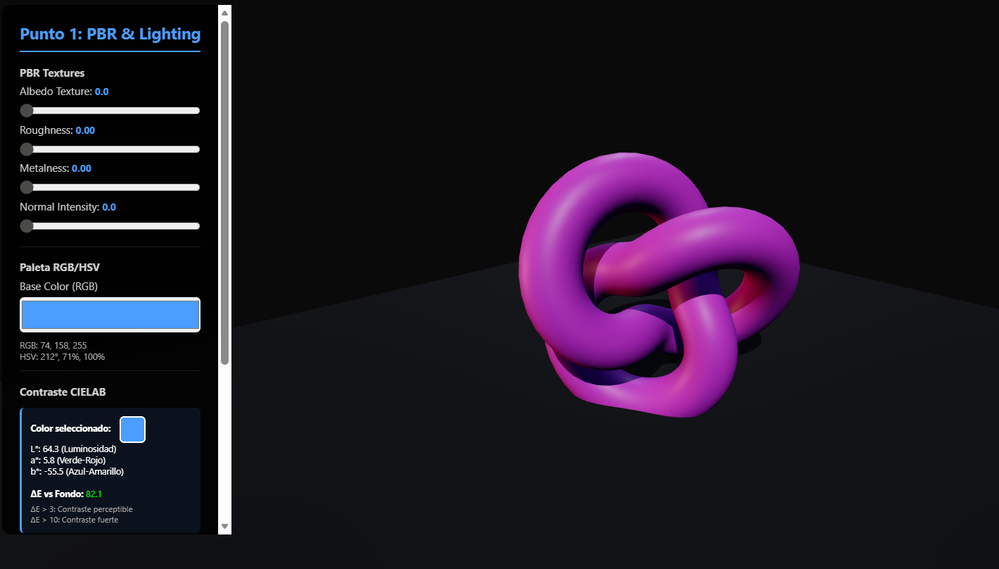
*Figura 1.1: Albedo Texture al 0% (Color Random)*

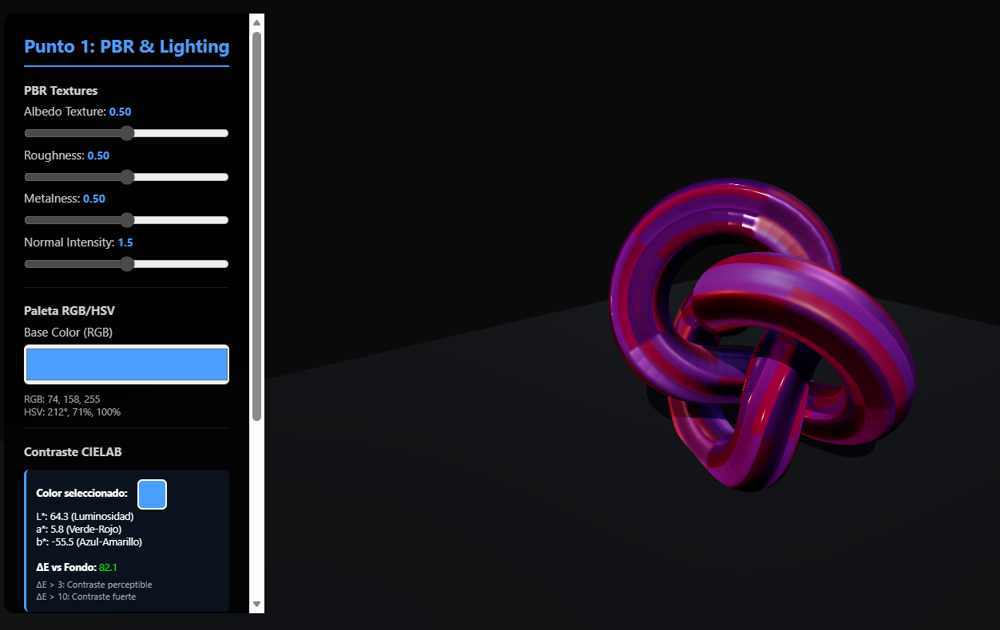
*Figura 1.2: Albedo Texture al 50%*

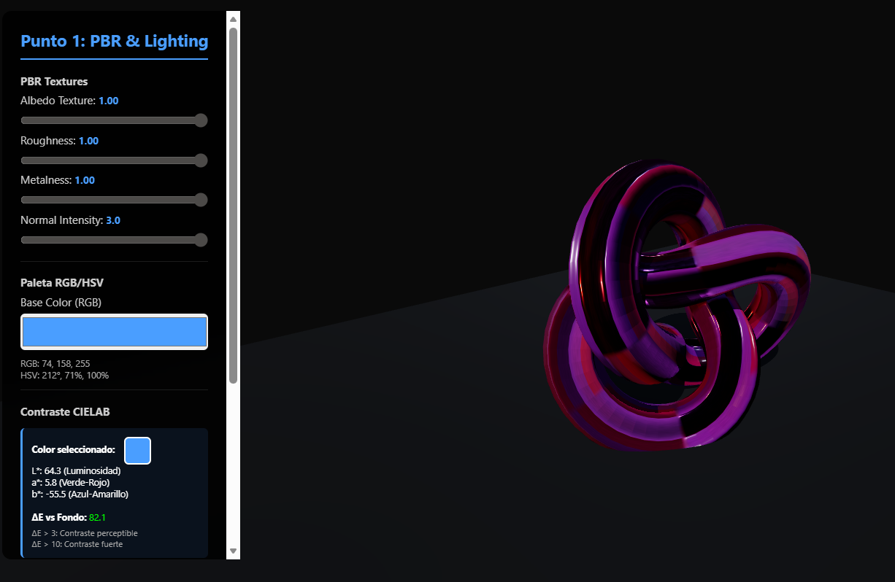
*Figura 1.3: Albedo Texture al 100%*

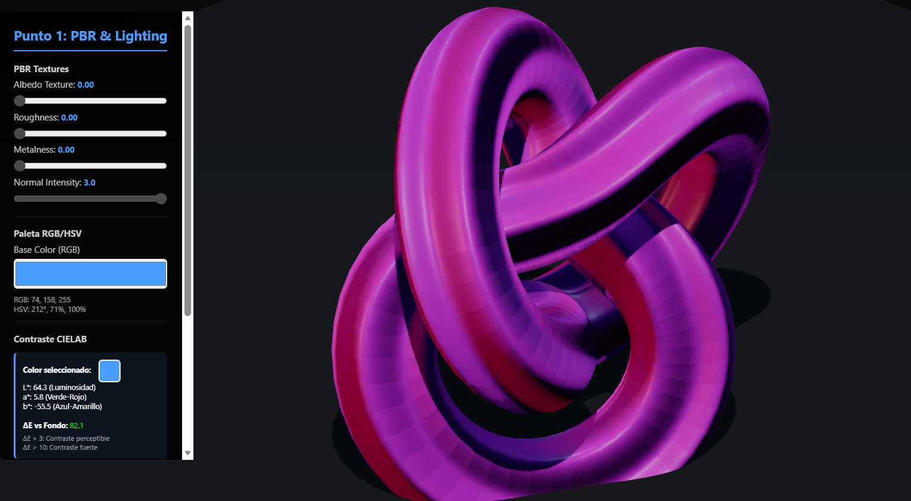
*Figura 1.4: Cámara Ortográfica*


*Animación 1.1: Demostración completa de materiales PBR, iluminación y conversión de espacios de color*

---

### 2. Modelado procedural desde código

**Implementación:** Python Jupyter Notebook (`Ejercicio 2.ipynb`)

**Características:**
- Generación de geometría mediante algoritmos matemáticos
- **Rejillas deformadas:** superficies paramétricas con funciones senoidales
- **Espirales 3D:** espiral archimediana con crecimiento radial y elevación
- **Fractales:** implementación del conjunto de Mandelbrot y árbol fractal
- Modificación dinámica de vértices y transformaciones espaciales
- Comparativa: modelado procedural vs modelado manual tradicional

**Conceptos aplicados:**
- Generación paramétrica de superficies
- Funciones matemáticas para deformación (sin, cos, exponenciales)
- Recursión para estructuras fractales
- Optimización mediante NumPy para cálculos vectorizados

**Código relevante:**
```python
def generate_grid(width=2.0, depth=2.0, nx=20, ny=20, z_func=None):
    xs = np.linspace(-width/2, width/2, nx)
    ys = np.linspace(-depth/2, depth/2, ny)
    verts = []
    for y in ys:
        for x in xs:
            z = 0 if z_func is None else z_func(x, y)
            verts.append([x, y, z])
    return np.array(verts)

# Rejilla con deformación senoidal
verts, faces = generate_grid(2, 2, 40, 40, 
                             z_func=lambda x,y: 0.3*math.sin(3*x)*math.cos(3*y))
```

**Ventajas del modelado procedural:**
- Modificación paramétrica instantánea
- Generación de variaciones infinitas
- Código reutilizable y escalable
- Precisión matemática

**Evidencias:**

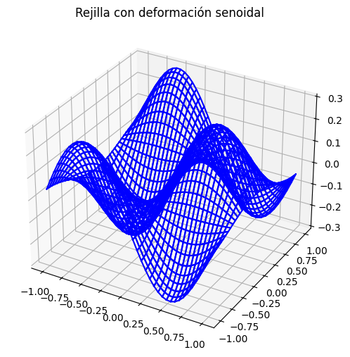
*Figura 2.1: Rejilla deformada con función senoidal*

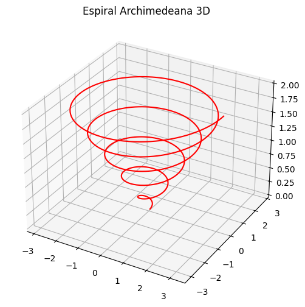
*Figura 2.2: Espiral archimediana 3D con crecimiento radial*

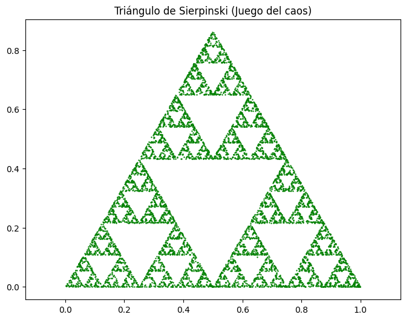
*Figura 2.3: Fractal - Triángulo de Sierpinski*

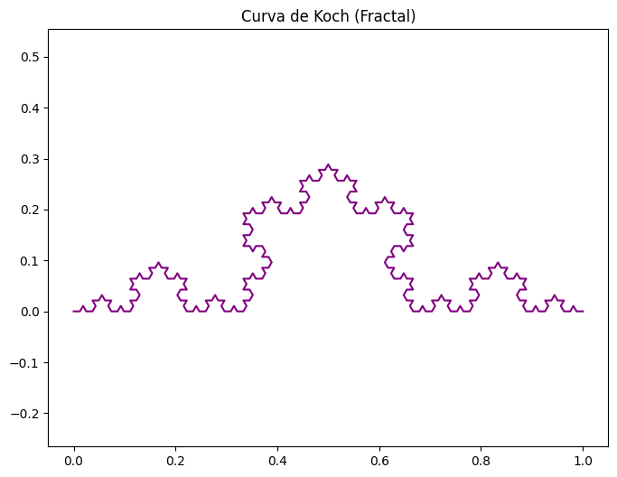
*Figura 2.4: Fractal - Curva de Koch*

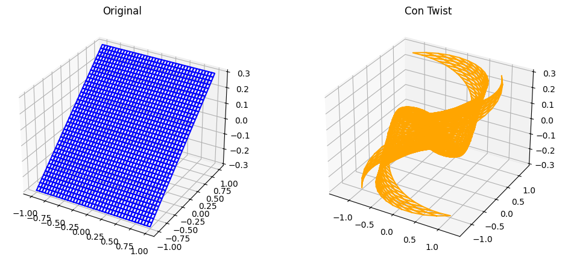
*Figura 2.5: Comparativa modelado procedural vs manual*

---

### 3. Shaders personalizados y efectos

**Implementación:** Three.js GLSL (`punto3.html`)

**Características:**
- **Toon Shading:** cel-shading con 4 bandas de iluminación
- **Gradientes animados:** transiciones de color suaves
- **Wireframe procedural:** coordenadas baricéntricas
- **Color por posición:** mapeo XYZ → RGB
- **Color por tiempo:** ciclo RGB animado
- **Color por interacción:** respuesta a posición del mouse
- **Distorsión UV:** checkerboard con ondas senoidales
- **Textura procedural:** ruido Perlin con FBM (Fractional Brownian Motion)
- **Mezcla de capas dinámicas:** combinación de múltiples efectos

**Conceptos aplicados:**
- Separación vertex shader (geometría) vs fragment shader (color/lighting)
- Uniforms compartidos para sincronización (`time`, `speed`, `mousePos`)
- Varyings para comunicación entre shaders
- Noise procedural con múltiples octavas

**Código relevante - Fragment Shader UV Distortion:**
```glsl
uniform float time;
varying vec2 vUv;

void main() {
    // UV distortion con ondas senoidales
    vec2 distortedUV = vUv;
    distortedUV.x += sin(vUv.y * 10.0 + time) * 0.1;
    distortedUV.y += cos(vUv.x * 10.0 + time * 1.3) * 0.1;
    
    // Patrón checkerboard sobre UVs distorsionadas
    vec2 grid = fract(distortedUV * 8.0);
    float checker = step(0.5, grid.x) + step(0.5, grid.y);
    checker = mod(checker, 2.0);
    
    vec3 color1 = vec3(0.29, 0.62, 1.0);  // Azul
    vec3 color2 = vec3(1.0, 0.66, 0.29);  // Naranja
    vec3 color = mix(color1, color2, checker);
    
    gl_FragColor = vec4(color, 1.0);
}
```

**Evidencias:**

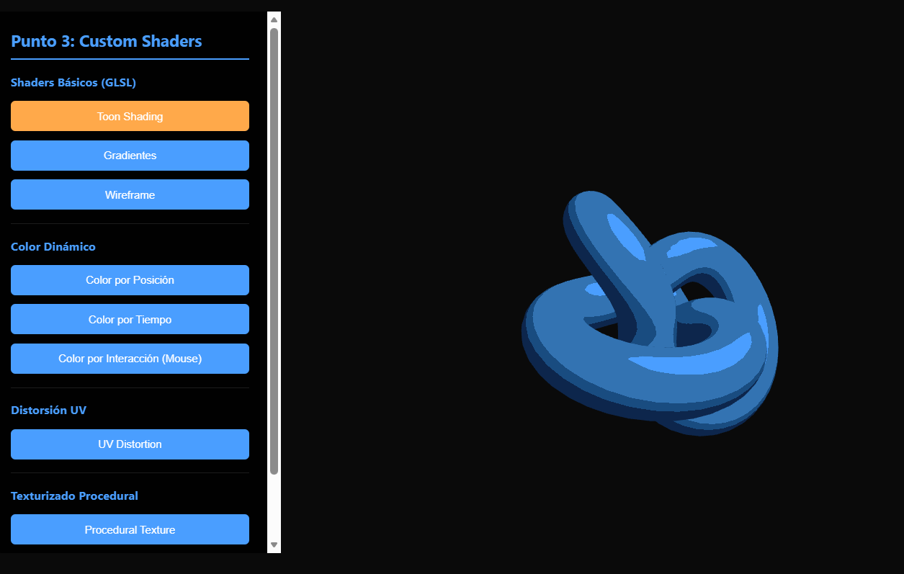
*Figura 3.1: Toon Shading (Cel-Shading con 4 bandas)*

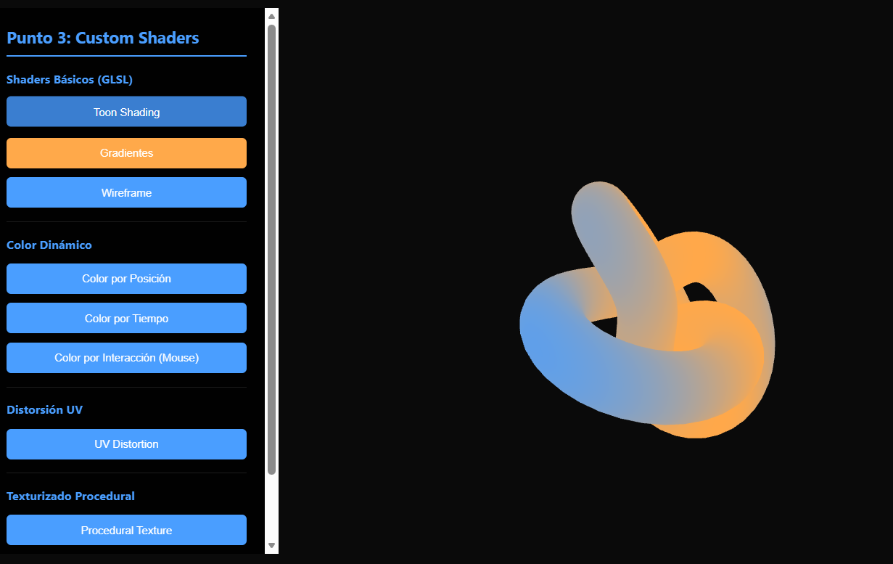
*Figura 3.2: Gradientes animados*

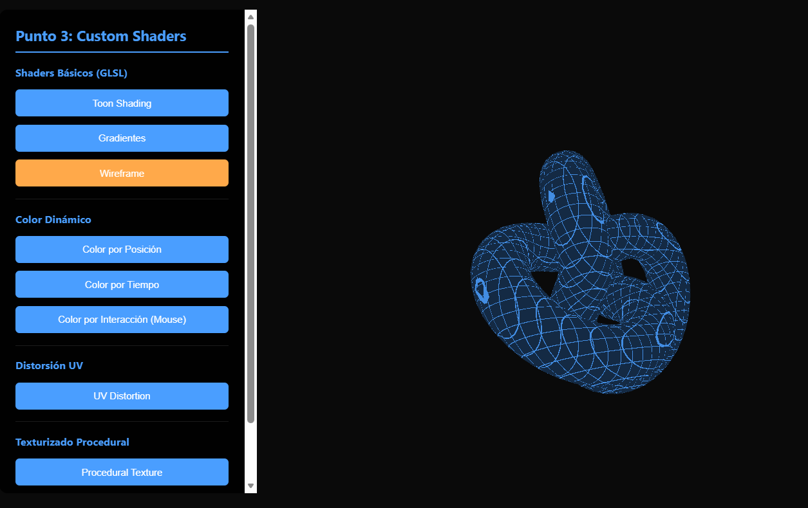
*Figura 3.3: Wireframe procedural*

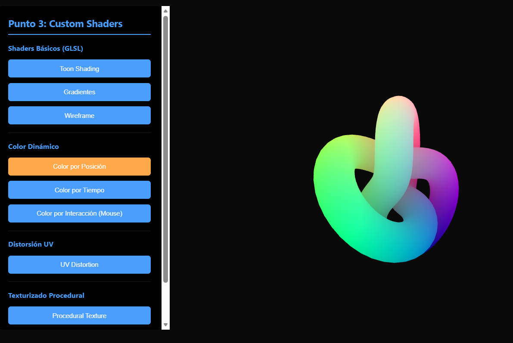
*Figura 3.4: Color por Posición (XYZ → RGB)*

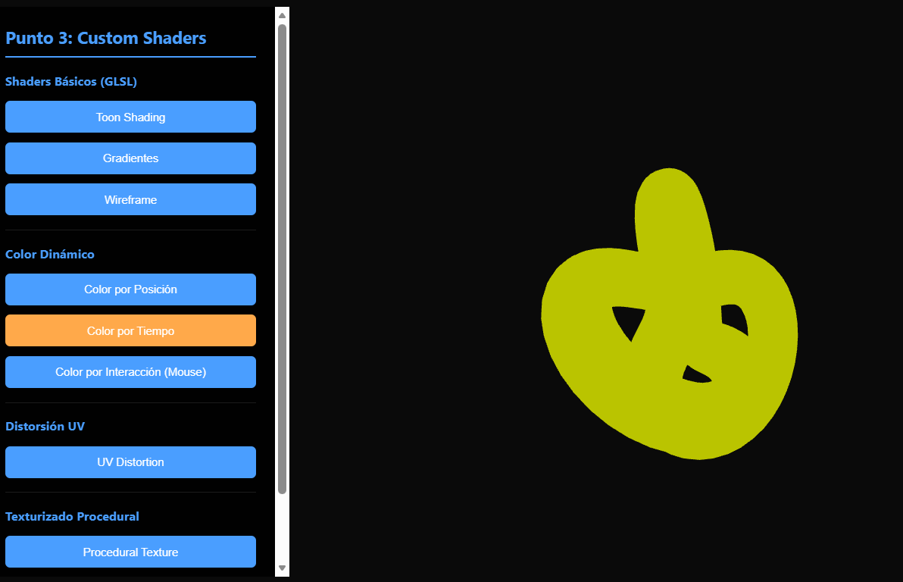
*Figura 3.5: Color por Tiempo (ciclo RGB)*

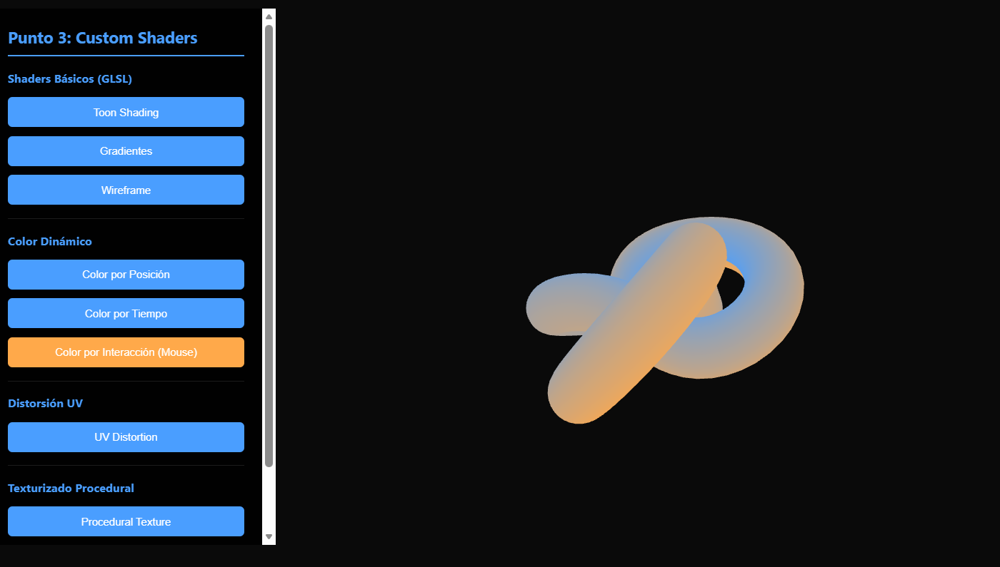
*Figura 3.6: Color por Interacción (Mouse)*

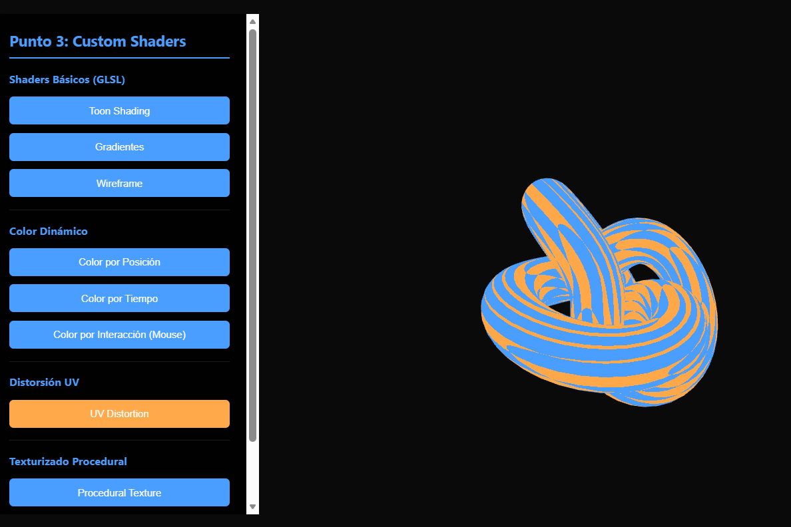
*Figura 3.7: Distorsión UV con Checkerboard*

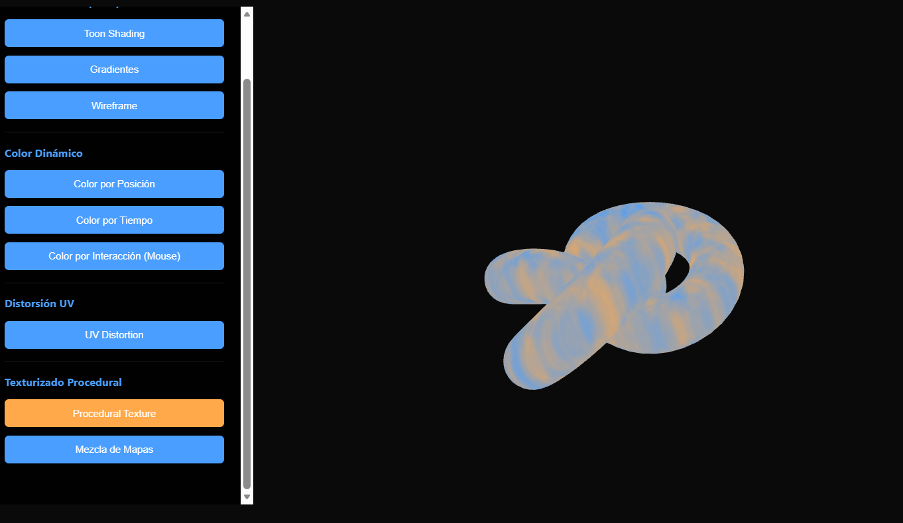
*Figura 3.8: Textura Procedural (Perlin FBM)*

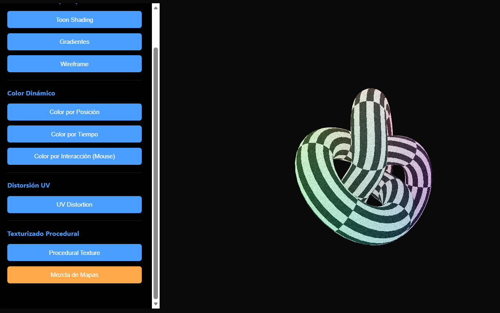
*Figura 3.9: Mezcla de Capas Dinámicas*


*Animación 3.1: Demostración completa de shaders personalizados y efectos GLSL*

---

### 4. Texturizado dinámico y partículas

**Implementación:** Three.js (`punto4.html`)

**Características:**
- Materiales reactivos a tiempo, input y sensores
- Normal maps y noise animados mediante Canvas
- Mapas emissive pulsantes sincronizados
- UV offset animado para desplazamiento de texturas
- Sistema de partículas con BufferGeometry (≈1000 partículas)
- Modos de partículas: Orbital, Explosion, Spiral
- Blending aditivo y vertex colors HSV
- Eventos coordinados: flash emissive + explosión de partículas

**Conceptos aplicados:**
- Actualización dinámica de texturas (Canvas → Texture)
- Sincronización shader + partículas vía uniforms compartidos
- BufferGeometry con Float32Array para performance
- Eventos temporales coordinados con control de progreso

**Código relevante - Trigger de evento coordinado:**
```javascript
function triggerEvent(eventType) {
    const duration = 2.0; // segundos
    const startTime = clock.getElapsedTime();
    
    function animateEvent() {
        const elapsed = clock.getElapsedTime() - startTime;
        const progress = Math.min(elapsed / duration, 1.0);
        
        switch(eventType) {
            case 'explosion':
                const explosionValue = Math.sin(progress * Math.PI) * 2.0;
                materialUniforms.explosionFactor.value = explosionValue;
                particleUniforms.explosionFactor.value = explosionValue;
                materialUniforms.emissiveIntensity.value = explosionValue * 0.5;
                break;
        }
        
        if (progress < 1.0) {
            requestAnimationFrame(animateEvent);
        } else {
            // Reset a cero
            materialUniforms.explosionFactor.value = 0;
            particleUniforms.explosionFactor.value = 0;
        }
    }
    
    animateEvent();
}
```

**Evidencias:**

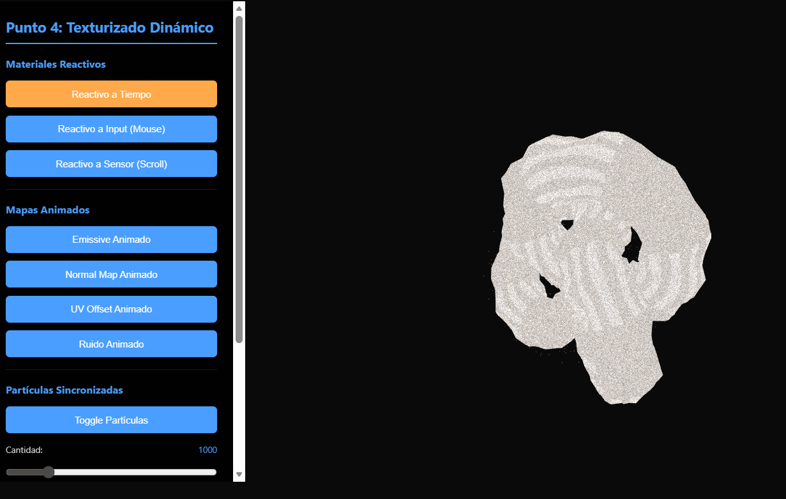
*Figura 4.1: Material Reactivo a Tiempo*

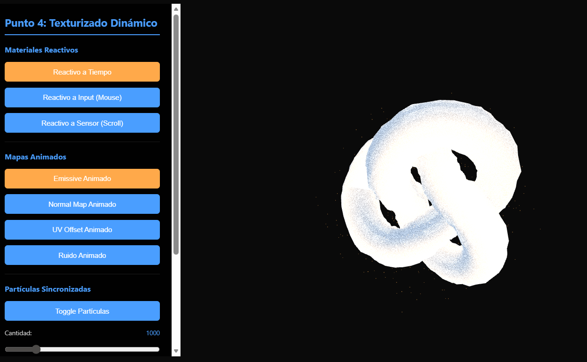
*Figura 4.2: Emissive Animado*

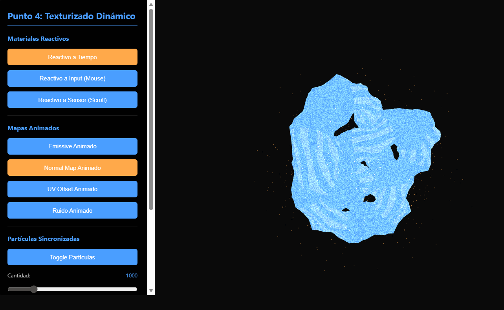
*Figura 4.3: Normal Map Animado*

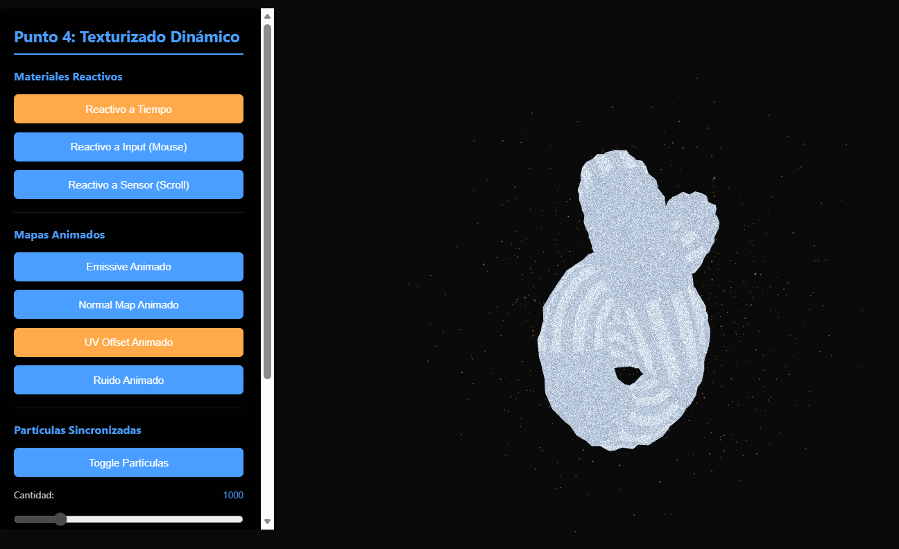
*Figura 4.4: UV Offset Animado*


*Animación 4.1: Sistema de partículas sincronizado con texturizado dinámico*

---

### 5. Visualización de imágenes y video 360°

**Implementación:** Python Jupyter Notebook (`Ejercico 5.ipynb`)

**Características:**
- Carga y visualización de imágenes equirectangulares
- Rotación horizontal simulando navegación 360°
- Widget interactivo con slider para control de rotación
- Soporte para video 360° como textura dinámica
- Preparación para implementación con esfera invertida o skybox

**Conceptos aplicados:**
- Mapeo equirectangular a esfera
- Transformaciones de imagen (rotación circular)
- Widgets interactivos con ipywidgets
- Preparación para skybox en Three.js

**Código relevante:**
```python
def rotate_image(img, shift):
    """Desplaza la imagen horizontalmente simulando rotación."""
    shift = shift % img.shape[1]
    return np.hstack((img[:, -shift:], img[:, :-shift]))

# Widget interactivo
@interact(shift=IntSlider(min=0, max=w-1, step=10, value=0))
def show_rotated(shift):
    rotated = rotate_image(img, shift)
    plt.figure(figsize=(10, 4))
    plt.imshow(rotated)
    plt.title(f"Vista 360° (desplazamiento: {shift}px)")
    plt.axis('off')
    plt.show()
```

**Aplicaciones:**
- Tours virtuales inmersivos
- Documentación de espacios arquitectónicos
- Visualización de entornos HDR para iluminación
- Integración con giroscopio en dispositivos móviles

**Evidencias:**

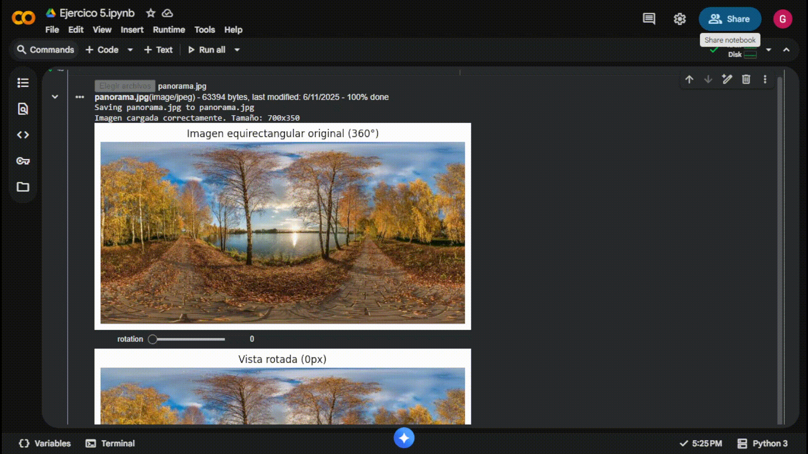
*Animación 5.1: Visualización interactiva de imagen 360° con rotación*

---

### 6. Entrada e interacción (UI, input y colisiones)

**Implementación:** Python Jupyter Notebook (`Ejercicio6.ipynb`)

**Características:**
- Captura de teclado, mouse y touch simulados
- UI con botones (spawn obstacle, reset) y sliders (velocidad)
- Sistema de colisiones físicas entre jugador y obstáculos
- Triggers que disparan efectos visuales (partículas en colisión)
- Sincronización de eventos visuales con acciones del usuario
- Render en tiempo real con PIL/ImageDraw
- Threading para bucle de juego asíncrono

**Conceptos aplicados:**
- Sistema de física básico (detección de colisiones circulares)
- Event-driven UI con ipywidgets
- Sistema de partículas con ciclo de vida
- Arquitectura de game loop con threading

**Código relevante - Detección de colisiones:**
```python
def check_collisions():
    px, py, pr = STATE["player"]["x"], STATE["player"]["y"], STATE["player"]["r"]
    for ob in STATE["obstacles"][:]:
        ox, oy, obr = ob["x"], ob["y"], ob["r"]
        dist = math.sqrt((px-ox)**2 + (py-oy)**2)
        if dist < (pr + obr):
            # Colisión detectada - spawn partículas
            for _ in range(12):
                angle = random.uniform(0, 2*math.pi)
                speed = random.uniform(1, 3)
                STATE["particles"].append({
                    "x": px, "y": py,
                    "vx": math.cos(angle)*speed,
                    "vy": math.sin(angle)*speed,
                    "life": 0, "max_life": 30,
                    "r": 3, "color": (255,200,100)
                })
            STATE["obstacles"].remove(ob)
            STATE["score"] += 10
```

**Características del sistema:**
- Respuesta inmediata a input del usuario
- Feedback visual mediante sistema de partículas
- Sistema de puntuación persistente
- Grid de fondo para referencia espacial

**Evidencias:**

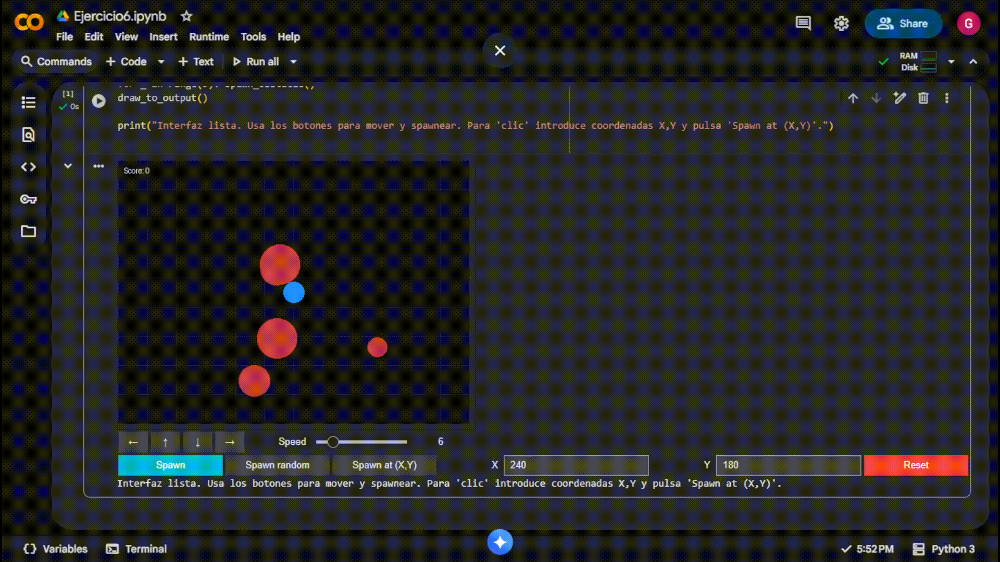
*Animación 6.1: Sistema de interacción con UI, colisiones y efectos de partículas*

---

### 7. Gestos con cámara web (MediaPipe Hands)

**Implementación:** Python (`Taller3_punto7.py`)

**Características:**
- Detección de manos en tiempo real con MediaPipe
- Conteo de dedos extendidos (0-5)
- Cálculo de distancia pulgar-índice para detección de pinch
- Detección de posición del dedo índice
- Minijuego de captura con colisiones landmark-objetivo
- Fallback a detector por color (HSV) cuando MediaPipe no está disponible
- Anotación visual de landmarks y conexiones

**Conceptos aplicados:**
- Detección de landmarks con MediaPipe Hands
- Heurísticas para conteo de dedos (comparación Y de landmarks)
- Distancia euclidiana para gestos (pinch)
- Mapeo coordenadas normalizadas → píxeles
- Arquitectura con fallback para robustez

**Código relevante - Conteo de dedos:**
```python
def count_fingers(hand_landmarks, handedness):
    # Índices de landmarks: pulgar=4, índice=8, medio=12, anular=16, meñique=20
    finger_tips = [4, 8, 12, 16, 20]
    finger_pips = [2, 6, 10, 14, 18]
    
    count = 0
    # Pulgar (comparación X según mano izquierda/derecha)
    if handedness == "Right":
        if hand_landmarks.landmark[4].x < hand_landmarks.landmark[3].x:
            count += 1
    else:
        if hand_landmarks.landmark[4].x > hand_landmarks.landmark[3].x:
            count += 1
    
    # Otros dedos (comparación Y)
    for tip, pip in zip(finger_tips[1:], finger_pips[1:]):
        if hand_landmarks.landmark[tip].y < hand_landmarks.landmark[pip].y:
            count += 1
    
    return count
```

**Evidencia:**


*Video 7.1: Demostración de detección de gestos con MediaPipe y minijuego de captura*

---

### 8. Reconocimiento de voz y control por comandos

**Implementación:** Python (`Taller3_Punto8.py`)

**Características:**
- Captura de audio en tiempo real con PyAudio y SpeechRecognition
- Reconocimiento local (CMU Sphinx) y online (Google Speech API)
- Diccionario de comandos extenso con variantes en español/inglés
- Normalización de texto con soporte Unicode (acentos, ñ)
- Matching robusto: phrase → token → fuzzy (difflib)
- Envío de mensajes OSC a Processing/Unity
- Retroalimentación por voz con pyttsx3 (TTS)
- Sistema TTS robusto con procesos separados (evita bloqueos)

**Conceptos aplicados:**
- Speech-to-Text con ajuste de ruido ambiente
- Procesamiento de lenguaje natural básico (normalización, matching)
- Comunicación inter-proceso con OSC
- Text-to-Speech con multiprocessing para robustez
- Manejo de latencias y timeouts

**Código relevante - Normalización y matching:**
```python
def normalize_text(t: str) -> str:
    s = (t or "").lower().strip()
    s = re.sub(r"[^\w\sáéíóúüñ]", " ", s, flags=re.UNICODE)
    s = re.sub(r"\s+", " ", s).strip()
    return s

def match_command(recognized_text):
    normalized = normalize_text(recognized_text)
    
    # 1. Matching por frase completa
    for cmd, variants in COMMAND_MAP.items():
        for variant in variants:
            if normalize_text(variant) == normalized:
                return cmd
    
    # 2. Matching por tokens
    tokens = normalized.split()
    for cmd, variants in COMMAND_MAP.items():
        for variant in variants:
            if all(t in tokens for t in normalize_text(variant).split()):
                return cmd
    
    # 3. Matching fuzzy
    from difflib import SequenceMatcher
    best_match = None
    best_ratio = 0.6  # Umbral mínimo
    for cmd, variants in COMMAND_MAP.items():
        for variant in variants:
            ratio = SequenceMatcher(None, normalized, 
                                   normalize_text(variant)).ratio()
            if ratio > best_ratio:
                best_ratio = ratio
                best_match = cmd
    
    return best_match
```

**Comandos soportados:**
- Control de juego: iniciar, pausar, reanudar, detener, salir
- Movimiento: arriba, abajo, izquierda, derecha
- Acciones: captura, confirmar, cancelar
- Navegación: siguiente, anterior, menú

**Evidencia:**


*Video 8.1: Control por voz con envío OSC y feedback TTS*

---

### 9. Interfaces multimodales (voz + gestos)

**Implementación:** Python (`Taller3_punto9.py`)

**Características:**
- Integración simultánea de voz y gestos en tiempo real
- Hilos separados para voz (VoiceListener) y cámara (CameraPreview)
- Queue-based event system para sincronización
- Lógica condicional para acciones compuestas:
  - "Captura" por voz → espera pinch para confirmar
  - "Mover" por voz + posición del índice
- Interfaz visual reactiva con OpenCV overlay
- Sistema de scoring y feedback en tiempo real
- Fallback automático a detector por color si MediaPipe falla

**Conceptos aplicados:**
- Arquitectura multithread con sincronización
- Event-driven programming con colas
- Máquina de estados para comandos compuestos
- Fusión sensorial (audio + visual)
- Gestión de recursos compartidos (frame queue)

**Arquitectura:**
```
┌─────────────────┐
│ VoiceListener   │ (Thread)
│ SpeechRecog.    │────┐
└─────────────────┘    │
                       ├──→ Event Queue
┌─────────────────┐    │
│ CameraPreview   │────┤
│ MediaPipe/Color │    │
└─────────────────┘    │
                       ↓
┌─────────────────────────────┐
│ MultimodalGame              │
│ - Process events            │
│ - Update game state         │
│ - Render overlay (OpenCV)   │
│ - Check compound actions    │
└─────────────────────────────┘
```

**Código relevante - Procesamiento de eventos compuestos:**
```python
def process_events(self, events):
    for event in events:
        if event["type"] == "voice":
            cmd = event["command"]
            if cmd == "capture":
                self.state["waiting_for_pinch"] = True
                self.state["status_text"] = "Haz pinch para confirmar captura"
            elif cmd == "start_game":
                self.start_game()
            elif cmd == "stop_game":
                self.stop_game()
        
        elif event["type"] == "gesture":
            if event["gesture"] == "pinch" and self.state["waiting_for_pinch"]:
                self.capture_frame()
                self.state["waiting_for_pinch"] = False
                self.state["score"] += 10
            
            if "index_pos" in event:
                self.state["cursor_pos"] = event["index_pos"]
                self.check_collision()
```

**Interacciones soportadas:**
- Voz: comandos de alto nivel (iniciar, detener, capturar)
- Gestos: confirmación (pinch), navegación (posición índice), conteo de dedos
- Compuestas: comando por voz + gesto de confirmación

**Evidencia:**


*Video 9.1: Interfaz multimodal con integración voz + gestos en tiempo real*

---

### 10. Simulación BCI (EEG sintético y control)

**Implementación:** Python Jupyter Notebook (`Ejercicio 10.ipynb`)

**Características:**
- Generación de señales EEG sintéticas (Alpha 8-12Hz, Beta 13-30Hz)
- Filtros pasa banda con scipy.signal (Butterworth)
- Extracción de bandas Alpha y Beta
- Cálculo de umbrales de control (media + 2σ)
- Interfaz interactiva con PyGame
- Control visual basado en actividad cerebral simulada
- Visualización de señales filtradas y espectro de potencia

**Conceptos aplicados:**
- Procesamiento de señales biomédicas
- Diseño de filtros digitales (Butterworth bandpass)
- Análisis espectral (FFT)
- Umbrales adaptativos para clasificación
- Brain-Computer Interface básico

**Código relevante - Filtro pasa banda:**
```python
def butter_bandpass(lowcut, highcut, fs, order=4):
    nyq = 0.5 * fs
    low = lowcut / nyq
    high = highcut / nyq
    b, a = butter(order, [low, high], btype='band')
    return b, a

def bandpass_filter(data, lowcut, highcut, fs, order=4):
    b, a = butter_bandpass(lowcut, highcut, fs, order=order)
    y = lfilter(b, a, data)
    return y

# Configuración
fs = 250  # Hz
t = np.arange(0, 10, 1/fs)

# Generar señales
alpha = 50 * np.sin(2 * np.pi * 10 * t)  # 10 Hz
beta = 30 * np.sin(2 * np.pi * 20 * t)   # 20 Hz
eeg_signal = alpha + beta + 5*np.random.randn(len(t))

# Filtrar bandas
alpha_filt = bandpass_filter(eeg_signal, 8, 12, fs)
beta_filt = bandpass_filter(eeg_signal, 13, 30, fs)

# Umbrales de control
alpha_thresh = np.mean(alpha_filt) + 2*np.std(alpha_filt)
beta_thresh = np.mean(beta_filt) + 2*np.std(beta_filt)
```

**Control basado en bandas:**
- **Alpha elevado:** Estado de relajación → color azul, movimiento lento
- **Beta elevado:** Estado de concentración → color rojo, movimiento rápido
- **Ambos elevados:** Estado de alerta → color verde, rotación

**Aplicaciones potenciales:**
- Control de interfaz sin manos (accesibilidad)
- Juegos controlados por estados mentales
- Neurofeedback para entrenamiento cognitivo
- Detección de estados de atención/relajación

**Evidencias:**

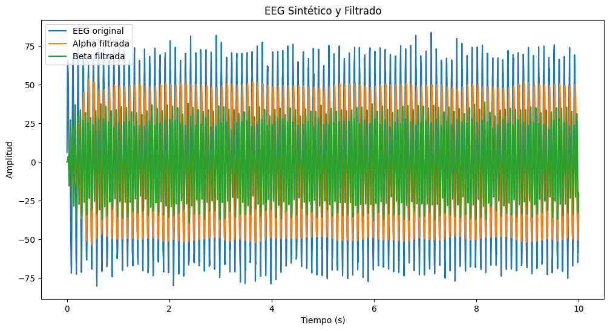
*Figura 10.1: Simulación BCI con filtrado de señales EEG y control visual*

---

### 11. Espacios proyectivos y matrices de proyección

**Implementación:** Python Jupyter Notebook (`Ejercicio11.ipynb`)

**Características:**
- Coordenadas homogéneas (x, y, z, w)
- Definición de cubo en 3D con vértices y aristas
- Matrices de proyección ortográfica y perspectiva
- Visualización de profundidad (depth buffer simulado)
- Animación de rotación con conmutación de cámaras
- Comparativa visual entre proyecciones

**Conceptos aplicados:**
- Transformaciones lineales con matrices 4×4
- Proyección ortográfica (sin distorsión de perspectiva)
- Proyección perspectiva (con punto de fuga)
- Pipeline de transformación: Model → View → Projection
- División de perspectiva (homogenización)

**Código relevante - Matrices de proyección:**
```python
def matriz_proyeccion_ortografica(left, right, bottom, top, near, far):
    """Proyección ortográfica (sin distorsión de profundidad)."""
    return np.array([
        [2/(right-left), 0, 0, -(right+left)/(right-left)],
        [0, 2/(top-bottom), 0, -(top+bottom)/(top-bottom)],
        [0, 0, -2/(far-near), -(far+near)/(far-near)],
        [0, 0, 0, 1]
    ])

def matriz_proyeccion_perspectiva(fov, aspect, near, far):
    """Proyección perspectiva (con punto de fuga)."""
    f = 1.0 / np.tan(np.radians(fov) / 2.0)
    return np.array([
        [f/aspect, 0, 0, 0],
        [0, f, 0, 0],
        [0, 0, (far+near)/(near-far), (2*far*near)/(near-far)],
        [0, 0, -1, 0]
    ])

# Aplicar proyección
def proyectar(vertices, matriz):
    proyectados = vertices @ matriz.T
    # División de perspectiva (homogeneización)
    proyectados = proyectados / proyectados[:, 3:4]
    return proyectados
```

**Comparativa:**

| Aspecto | Ortográfica | Perspectiva |
|---------|-------------|-------------|
| Líneas paralelas | Se mantienen paralelas | Convergen en punto de fuga |
| Distorsión de profundidad | No hay | Objetos lejanos más pequeños |
| Uso típico | Planos técnicos, CAD, vistas isométricas | Juegos, renders realistas, simulaciones |
| Preserva tamaños | Sí | No |

**Aplicaciones:**
- Entender el pipeline gráfico 3D completo
- Implementar cámaras personalizadas
- Debugging de sistemas de proyección
- Educación en gráficos por computadora

**Evidencias:**

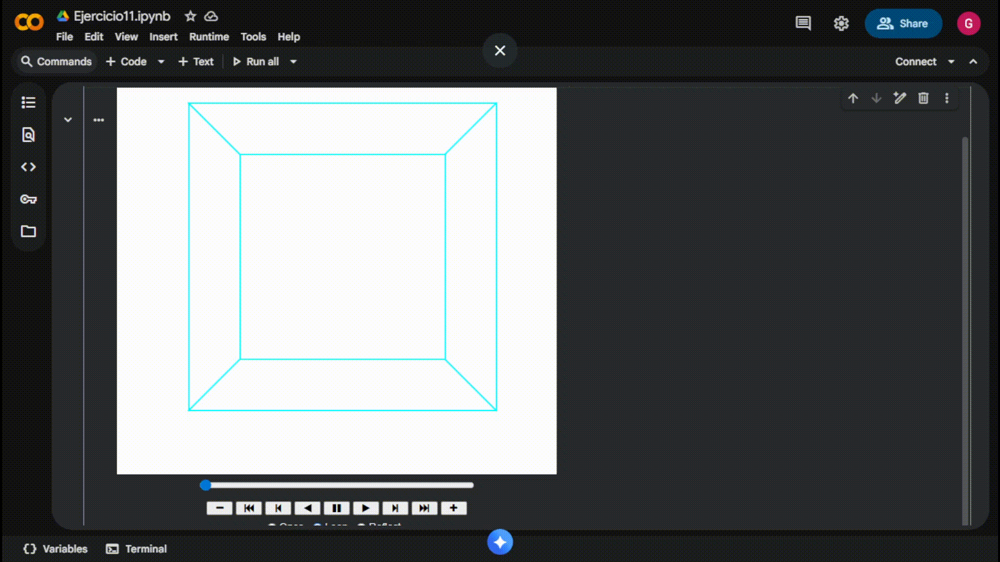
*Animación 11.1: Cubo rotando con alternancia entre proyección ortográfica y perspectiva*

---

## Código relevante o fragmentos clave

### Conversión RGB → CIELAB y cálculo de contraste

```javascript
function rgbToLab(r, g, b) {
    // 1. Linearización RGB (corrección gamma)
    let rLinear = r <= 0.04045 ? r / 12.92 : Math.pow((r + 0.055) / 1.055, 2.4);
    let gLinear = g <= 0.04045 ? g / 12.92 : Math.pow((g + 0.055) / 1.055, 2.4);
    let bLinear = b <= 0.04045 ? b / 12.92 : Math.pow((b + 0.055) / 1.055, 2.4);
    
    // 2. RGB a XYZ (iluminante D65)
    let x = rLinear * 0.4124564 + gLinear * 0.3575761 + bLinear * 0.1804375;
    let y = rLinear * 0.2126729 + gLinear * 0.7151522 + bLinear * 0.0721750;
    let z = rLinear * 0.0193339 + gLinear * 0.1191920 + bLinear * 0.9503041;
    
    // 3. Normalización por punto blanco D65
    x /= 0.95047;
    y /= 1.00000;
    z /= 1.08883;
    
    // 4. Función f (no linealidad perceptual)
    const f = (t) => t > 0.008856 ? Math.pow(t, 1/3) : (7.787 * t) + (16/116);
    
    // 5. Cálculo LAB
    let L = (116 * f(y)) - 16;
    let A = 500 * (f(x) - f(y));
    let B = 200 * (f(y) - f(z));
    
    return { L, A, B };
}

// Cálculo de ΔE (diferencia perceptual)
const bgLab = { L: 4, A: 0, B: 0 }; // Fondo #0a0a0a
const deltaE = Math.sqrt(
    Math.pow(lab.L - bgLab.L, 2) +
    Math.pow(lab.A - bgLab.A, 2) +
    Math.pow(lab.B - bgLab.B, 2)
);

// Clasificación de contraste
if (deltaE > 10) {
    // Excelente contraste (verde)
} else if (deltaE > 3) {
    // Contraste aceptable (naranja)
} else {
    // Contraste insuficiente (rojo)
}
```

**Importancia:** CIELAB es un espacio de color perceptualmente uniforme, donde distancias euclidianas corresponden a diferencias visuales percibidas. Útil para accesibilidad y diseño.

### Vertex Shader de partículas con explosión sincronizada

```glsl
uniform float time;
uniform float particleSize;
uniform float explosionFactor;

attribute vec3 velocity;
varying vec3 vColor;

void main() {
    vec3 pos = position;
    
    // Órbita alrededor del centro con matriz de rotación
    float angle = time * 0.5;
    mat3 rotation = mat3(
        cos(angle), 0.0, sin(angle),
        0.0, 1.0, 0.0,
        -sin(angle), 0.0, cos(angle)
    );
    pos = rotation * pos;
    pos += velocity * time;
    
    // Explosión sincronizada con material (uniform compartido)
    vec3 direction = normalize(pos);
    pos += direction * explosionFactor * 3.0;
    
    vColor = vec3(1.0, 0.66, 0.29); // Naranja
    
    vec4 mvPosition = modelViewMatrix * vec4(pos, 1.0);
    gl_PointSize = particleSize * (300.0 / -mvPosition.z);
    gl_Position = projectionMatrix * mvPosition;
}
```

**Características:**
- Órbita mediante matriz de rotación
- Velocity para movimiento individual
- Explosión radial sincronizada con material
- Point size con atenuación por profundidad


## Prompts e ideas base

**Para experimentación con modelos generativos (no utilizados en este proyecto):**

### Shaders y efectos visuales
- "Generate a GLSL fragment shader that simulates water ripples with caustics and soft blending"
- "Create a cel-shading (toon) shader with customizable band count and outline detection"
- "Design a procedural noise shader using FBM with 4 octaves for terrain generation"

### Paletas de color y diseño
- "Suggest a complementary color palette for a warm sunset cinematic key light with CIELAB values"
- "Generate an accessible color scheme with ΔE > 10 against #0a0a0a background"
- "Create a gradient palette transitioning from HSV(200, 0.8, 0.9) to HSV(30, 0.9, 1.0)"

### Optimización y performance
- "Suggest performance optimizations for rendering 100k particles in WebGL using GPU compute"
- "Design a spatial partitioning system for efficient collision detection in 2D game"
- "Optimize Canvas-based texture updates to minimize GPU uploads per frame"

### Interacción multimodal
- "Design a state machine for compound voice+gesture commands with timeout and cancellation"
- "Create a calibration routine for hand gesture detection under varying lighting conditions"
- "Suggest a natural language command parser for spatial navigation (rotate, zoom, pan)"

---

## Reflexión: aprendizajes, retos técnicos y mejoras posibles

### Aprendizajes principales

El desarrollo de este taller integrado proporcionó una comprensión profunda del pipeline gráfico 3D moderno. La implementación de Physically Based Rendering (PBR) nos mostró cómo las propiedades de metalness y roughness determinan la respuesta realista de los materiales ante diferentes condiciones de iluminación, mientras que el trabajo en el espacio perceptual CIELAB reveló su importancia crítica para accesibilidad y diseño centrado en la percepción humana. La separación entre vertex y fragment shaders emergió como la arquitectura fundamental del rendering contemporáneo, y las coordenadas homogéneas se consolidaron como la base matemática elegante que permite todas las transformaciones proyectivas.

En el ámbito del modelado procedural, descubrimos el extraordinario poder expresivo de las funciones matemáticas para generar geometría compleja mediante algoritmos. La recursión y los fractales nos mostraron la elegancia inherente a las definiciones autosimilares, donde patrones simples se replican a múltiples escalas para crear estructuras fascinantes. La principal ventaja sobre el modelado manual tradicional quedó clara: la capacidad de modificar parámetros instantáneamente y generar variaciones ilimitadas sin esfuerzo adicional.

El trabajo con shaders y rendering avanzado nos enseñó que los uniforms compartidos son clave para mantener sincronización temporal precisa entre materiales y sistemas de partículas. El noise procedural mediante Fractional Brownian Motion (FBM) demostró su capacidad para proporcionar texturas orgánicas complejas sin necesidad de mapas externos, mientras que BufferGeometry se reveló esencial para mantener performance aceptable al manejar más de 1000 elementos simultáneamente. Los blending modes aditivos probaron ser la técnica perfecta para lograr efectos convincentes de luz y fuego.

La exploración de interacción multimodal nos mostró que fusionar modalidades sensoriales requiere una arquitectura event-driven robusta capaz de manejar las latencias heterogéneas inherentes: mientras el reconocimiento de voz puede tomar hasta 300ms, la detección de gestos responde en aproximadamente 50ms, necesitando compensación cuidadosa. Implementar fallbacks mediante detección por color como respaldo ante fallos de MediaPipe incrementó significativamente la robustez del sistema. Los estados compuestos, donde comandos requieren confirmación gestual, añaden complejidad arquitectónica pero mejoran drásticamente la experiencia de usuario al prevenir activaciones accidentales.

Finalmente, el procesamiento de señales biológicas nos familiarizó con el diseño de filtros digitales Butterworth para extracción precisa de bandas de frecuencia EEG. Los umbrales adaptativos basados en media más dos desviaciones estándar (μ + 2σ) demostraron proporcionar clasificación robusta ante la variabilidad natural de señales fisiológicas. El trabajo con speech recognition nos enseñó que el ajuste dinámico del umbral de ruido ambiente resulta crítico para funcionamiento confiable en entornos reales no controlados.

### Retos técnicos enfrentados

Los desafíos de rendering y performance se manifestaron en múltiples frentes simultáneamente. Las texturas dinámicas generadas desde Canvas resultaron extremadamente costosas cuando se actualizaban cada frame, obligándonos a optimizar el sistema para actualizar únicamente cuando los parámetros visuales cambiaban efectivamente. El wireframe baricéntrico demostró ser más complejo de lo anticipado, requiriendo geometría personalizada o cálculos específicos en el vertex shader que no están disponibles nativamente en Three.js. Las sombras con Percentage Closer Filtering (PCF) exigieron encontrar un balance delicado entre calidad visual, determinada por la resolución del shadow map, y el impacto inevitable en el performance. El reto más constante fue mantener consistentemente 60 frames por segundo mientras ejecutábamos simultáneamente sistemas de partículas activos y múltiples shaders computacionalmente complejos.

La multimodalidad trajo su propio conjunto de obstáculos técnicos significativos. La robustez ante iluminación variable se convirtió en una preocupación constante, ya que aunque el espacio de color HSV es superior a RGB, sigue siendo sensible a las condiciones de lighting y requiere calibración específica para cada entorno de uso. La compatibilidad con cámaras en Windows resultó inconsistente y frustrante, con comportamientos diferentes entre los backends CAP_DSHOW, CAP_MSMF y CAP_ANY de OpenCV, requiriendo pruebas exhaustivas para cada configuración de hardware. El Text-to-Speech con pyttsx3 se reveló como bloqueante y propenso a colgar el hilo principal de la aplicación, problema que finalmente resolvimos migrando la funcionalidad a un proceso separado mediante multiprocessing. La latencia del reconocimiento de voz evidenció un trade-off fundamental: los servicios online como Google ofrecen mayor precisión pero son significativamente más lentos que las alternativas de procesamiento local.

Los retos de integración sistémica exigieron atención meticulosa a detalles matemáticos y de arquitectura. La conversión entre espacios de color, particularmente de RGB a CIELAB, requirió implementar correctamente la corrección gamma y utilizar el iluminante estándar D65 para garantizar resultados perceptualmente precisos. Las proyecciones matemáticas, especialmente la división de perspectiva en coordenadas homogéneas, demandaron comprensión profunda de geometría proyectiva para evitar artefactos visuales. La sincronización entre threads mediante event queues sin crear race conditions necesitó diseño cuidadoso de patrones de concurrencia y mecanismos de locking apropiados. El networking mediante protocolo OSC para comunicación con herramientas externas como Processing y Unity requirió atención especial al timing y formato exacto de los mensajes para garantizar transmisión confiable de datos de interacción en tiempo real.

### Mejoras posibles

Mirando hacia el futuro del proyecto, identificamos numerosas oportunidades de mejora que elevarían significativamente tanto la calidad visual como las capacidades interactivas. En el ámbito de rendering y visuales, la incorporación de HDRIs reales mediante `RGBELoader` transformaría completamente el realismo de las escenas al proporcionar reflexiones y iluminación basada en imágenes fotorrealistas. El post-processing avanzado usando `EffectComposer` con efectos como bloom, tone mapping ACES, Screen Space Ambient Occlusion (SSAO) y motion blur añadiría una capa de calidad cinematográfica profesional. Migrar el sistema de partículas a `GPUComputationRenderer` nos permitiría escalar dramáticamente a más de 100,000 partículas simultáneas manteniendo frame rates aceptables. La implementación de modelos physically-based para el cielo, como Preetham o Hosek-Wilkie, proporcionaría iluminación atmosférica dinámica realista que cambia naturalmente según la hora del día simulada.

Las mejoras en interacción abrirían posibilidades expresivas fascinantes. La integración con Web Audio API permitiría reactividad visual directa a frecuencias, beats y volumen de audio en tiempo real, creando experiencias audiovisuales verdaderamente sincronizadas. Un sistema de calibración automática donde el usuario simplemente muestra un objeto de referencia o su mano para ajustar los rangos HSV eliminaría la configuración manual tediosa y mejoraría la adaptabilidad a diferentes entornos de iluminación. El filtrado temporal que confirma gestos durante múltiples frames consecutivos (por ejemplo, N=5) reduciría drásticamente los falsos positivos, haciendo la interacción mucho más confiable y predecible. El soporte multiusuario con detección simultánea de múltiples manos y voces abriría posibilidades colaborativas completamente nuevas, permitiendo experiencias compartidas e interacciones sociales.

Desde la perspectiva arquitectónica, la migración a un sistema robusto de state management como Redux o MobX traería orden y predictibilidad a interfaces complejas con múltiples estados interrelacionados. La adopción de bibliotecas de UI más sofisticadas como lil-gui o dat.gui con persistencia de presets en localStorage mejoraría sustancialmente la experiencia de configuración y experimentación. La implementación de tests automáticos para funciones puras como `normalize_text` y `match_command` usando frameworks como Jest para JavaScript o Pytest para Python incrementaría la confiabilidad y facilitaría el mantenimiento a largo plazo. Un pipeline completo de CI/CD con GitHub Actions para linting automático, ejecución de tests y generación de builds garantizaría calidad consistente en cada commit al repositorio.

Las mejoras en accesibilidad harían el proyecto verdaderamente inclusivo. Un modo de alto contraste con paletas cuidadosamente diseñadas que garanticen diferencias de color ΔE superiores a 50 haría el contenido utilizable para personas con baja visión o daltonismo. Ofrecer control exclusivamente por voz como alternativa completa y funcional a los gestos beneficiaría enormemente a usuarios con movilidad reducida en las extremidades superiores. Los subtítulos en tiempo real que muestren visualmente los comandos de voz reconocidos proporcionarían retroalimentación crucial para usuarios con discapacidad auditiva. Sliders de ajuste de sensibilidad para los umbrales de detección de gestos y voz permitirían personalización fina según las capacidades motoras y fonéticas individuales de cada usuario.

Las optimizaciones de performance desbloquearían escenas más complejas y detalladas. La implementación de Level of Detail (LOD) reduciría automáticamente la complejidad geométrica de objetos lejanos donde el detalle no es perceptible. El frustum culling eliminaría completamente el procesamiento de objetos fuera del campo de visión de la cámara. El texture atlasing combinaría múltiples texturas pequeñas en atlas unificados para minimizar draw calls y state changes en la GPU. Los Web Workers permitirían offload de cálculos computacionalmente pesados como generación de noise procedural o detección de colisiones complejas a threads separados que no bloqueen el loop principal de rendering.

Finalmente, las features completamente nuevas expandirían las fronteras de lo posible. El hand tracking 3D usando cámaras de profundidad estéreo o Intel RealSense capturaría la posición espacial completa de las manos en tres dimensiones, permitiendo interacciones mucho más naturales e intuitivas. El eye tracking mediante hardware como Tobii o soluciones de software como WebGazer.js permitiría control de cámara mediante la mirada, una forma de interacción natural que reduce significativamente la fatiga. MediaPipe Pose abriría posibilidades de control mediante el cuerpo completo más allá de solo las manos, capturando movimientos de torso, piernas y cabeza. La migración a WebXR habilitaría experiencias completamente inmersivas en dispositivos de realidad virtual como Meta Quest o realidad aumentada como Microsoft HoloLens. Por último, entrenar modelos de Machine Learning personalizados para reconocer gestos custom específicos de cada aplicación o dominio expandiría infinitamente el vocabulario gestual disponible, permitiendo interfaces verdaderamente adaptadas a contextos especializados.
