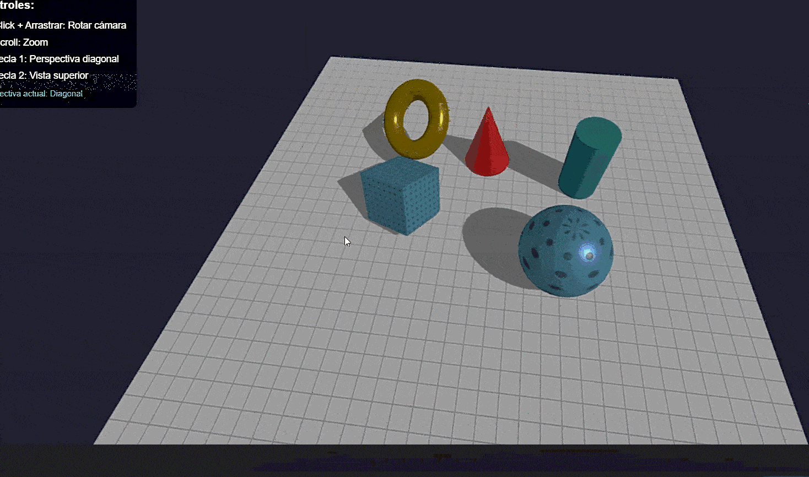

# Examen Final - Computación Visual


## Punto 1 - Python

### Descripción del Enfoque

Implementación de técnicas de procesamiento de imágenes usando filtros de convolución y operaciones morfológicas con OpenCV.

### Resultados


### Instrucciones de Ejecución

1. Sube el archivo `python/examen_final_python.ipynb` a Google Colab
2. Ejecuta las celdas secuencialmente


## Punto 2 - Three.js

### Descripción de la Escena

Escena 3D interactiva con formas geométricas básicas (cubo, esfera, cono, cilindro, toroide y plano). Incluye dos texturas diferentes, sistema de iluminación con dos luces, animaciones continuas y controles de cámara con OrbitControls para rotación y zoom.

### Resultados



### Instrucciones de Ejecución

1. Navega a la carpeta del proyecto:
   ```bash
   cd examen_final/threejs
   ```

2. Instala las dependencias:
   ```bash
   npm install
   ```

3. Inicia el servidor de desarrollo:
   ```bash
   npm run dev
   ```

4. Abre tu navegador en `http://localhost:5173`
